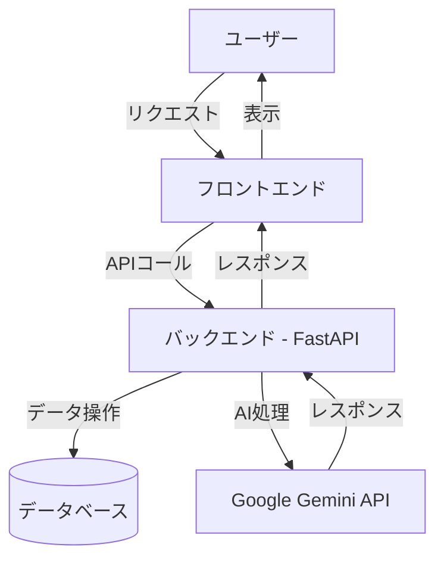
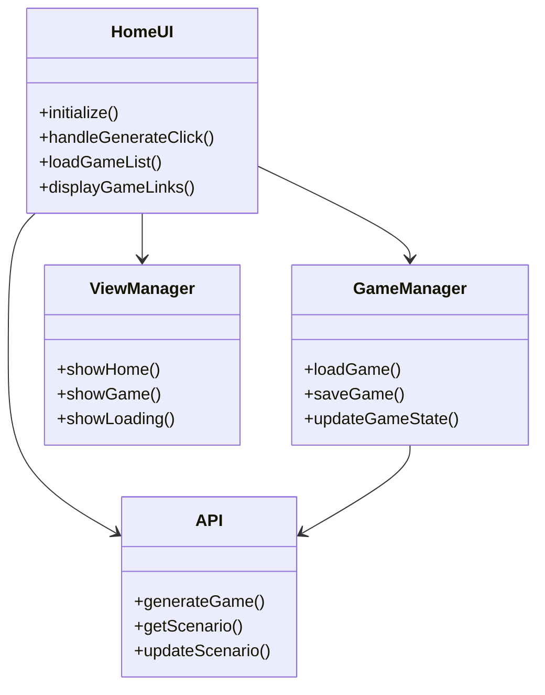

# NovelGenPage アーキテクチャ概要

## システム構成図



## フロントエンド構造



## データフロー

1. **ゲーム生成フロー**:
   ```mermaid
   sequenceDiagram
       participant U as ユーザー
       participant FE as フロントエンド
       participant BE as バックエンド
       participant AI as Gemini API
       participant DB as データベース
       
       U->>FE: テーマとキーワードを入力
       FE->>BE: ゲーム生成リクエスト
       BE->>AI: プロンプト送信
       AI-->>BE: 生成されたシナリオ
       BE->>DB: シナリオ保存
       BE-->>FE: 生成完了レスポンス
       FE-->>U: ゲーム開始画面を表示
   ```

2. **ゲームプレイフロー**:
   ```mermaid
   sequenceDiagram
       participant U as ユーザー
       participant FE as フロントエンド
       participant BE as バックエンド
       participant DB as データベース
       
       U->>FE: アクション選択
       FE->>BE: ゲーム状態更新リクエスト
       BE->>DB: データ取得/更新
       BE-->>FE: 更新されたゲーム状態
       FE-->>U: 次のステップを表示
   ```

## 主要コンポーネント

### フロントエンド
- **HomeUI**: ホーム画面のUI管理
- **GameManager**: ゲームの状態管理
- **ViewManager**: 画面遷移管理
- **API**: バックエンドとの通信

### バックエンド
- **FastAPI**: RESTful APIサーバー
- **Gemini Client**: Google Gemini APIとの連携
- **Scenario Handler**: シナリオの保存・読み込み処理

## データモデル

### ゲームデータ
```typescript
interface GameData {
    id: string;
    title: string;
    description: string;
    created_at: string;
    updated_at: string;
    scenes: Scene[];
}

interface Scene {
    id: string;
    title: string;
    content: Content[];
    is_final: boolean;
    actions: Action[];
}

interface Content {
    type: 'text' | 'image' | 'action';
    value: string;
}

interface Action {
    text: string;
    next_scene_id: string;
    conditions?: Condition[];
}

interface Condition {
    type: 'inventory_has' | 'flag_is';
    // 条件に応じた追加フィールド
}
```
